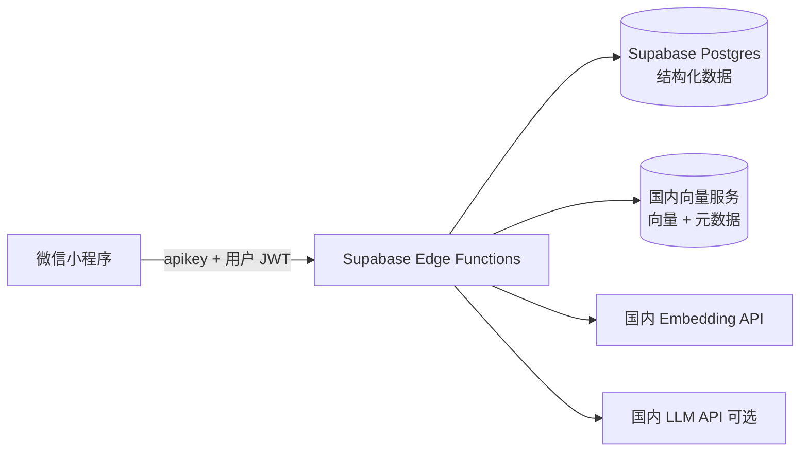

# Supabase + 国内向量服务 + 原生微信小程序：RAG 落地方案

本文档描述在**已完成 Supabase 与微信小程序 JWT 鉴权、用户表**的前提下，引入**国内向量服务**与 **RAG（向量检索 + 问答）** 的架构、表结构、接口划分与实施步骤。

> **v3 关键变更**：Supabase 中国区不适合存储向量数据（网络延迟、数据合规等因素），因此将向量层拆分到**国内向量数据库服务**，Supabase 仅保留鉴权与结构化业务数据。

**前置条件（已实现）**

- 小程序经 Edge Function（`hyper-service`）完成登录，本地持久化 `access_token` / `refresh_token` / `user`（参见项目 `utils/auth.js`、`utils/config.js`）。
- Supabase 侧已存在与 `auth.users` 对齐的用户画像/用户表，后续 RLS 以 **`auth.uid()`** 为隔离维度。
- 项目已推送至 GitHub：[https://github.com/Weiwong1996/wechat-mini-app](https://github.com/Weiwong1996/wechat-mini-app)

---

## 1. 架构原则：存储分离

| 层级 | 服务 | 职责 |
|------|------|------|
| 微信小程序 | — | UI、`wx.request` 调用 HTTPS；请求头携带 `apikey` + 用户 JWT；**不存放**任何服务端密钥 |
| Edge Functions | Supabase | 编排层：校验 JWT → 调用 Embedding API → 同时写 Supabase 结构化数据 + 写国内向量库 → 检索时从向量库取 Top-K → 拼上下文调 LLM |
| 结构化数据 | Supabase Postgres | `documents` 表存文档正文与状态；`document_chunks` 表存文本与元数据（**不含向量**）；RLS 按 `user_id = auth.uid()` |
| 向量存储与检索 | 国内向量服务 | 存 embedding + 元数据（`user_id`、`chunk_id`）；按 `user_id` 过滤检索；**不存正文**（正文在 Supabase） |
| Embedding & LLM | 国内 API | 中文 Embedding 模型（如通义 text-embedding-v4）；LLM 可选（通义千问 / 智谱 / 腾讯混元等） |

**核心思路**：Supabase 是「事实源」（存正文、用户、状态），国内向量服务是「索引层」（只存向量 + 引用 ID），两边通过 `chunk_id` 关联。

整体数据流：



### 1.1 为什么不用 Supabase pgvector

| 因素 | 说明 |
|------|------|
| 网络延迟 | Supabase 节点在海外，中国用户访问向量写入/检索延迟高，影响体验 |
| 数据合规 | 育儿类用户内容可能涉及个人信息，向量数据存储在国内更符合数据出境监管 |
| Embedding 延迟 | 中文 Embedding 调国内 API 更快，若向量库也在国内，写入链路整体延迟更低 |
| 后续扩展 | 国内向量服务通常自带文档解析、切片、Embedding 管道，可减少自建工程量 |

### 1.2 鉴权头说明（与现有代码对齐）

项目 `utils/auth.js` 中已有两种场景的鉴权头：

| 场景 | 请求头 | 说明 |
|------|--------|------|
| **登录**（发 `code` 换 JWT） | `Authorization: Bearer <anon_key>` | 由现有 `buildAuthHeaders()` 提供；此时用户尚无 JWT |
| **RAG 等已登录请求** | `Authorization: Bearer <access_token>` + `apikey: <anon_key>` | 需**新增** `buildUserAuthHeaders(accessToken)` 函数 |

建议在 `utils/auth.js` 中新增：

```js
function buildUserAuthHeaders(accessToken) {
  return {
    'Content-Type': 'application/json',
    apikey: SUPABASE_ANON_KEY,
    Authorization: `Bearer ${accessToken}`
  }
}
```

所有 RAG 相关请求应使用此函数，而非 `buildAuthHeaders()`。

### 1.3 Edge Function 部署模式

项目当前使用**单入口** Edge Function（`hyper-service`，见 `utils/config.js`），登录请求通过 `POST { code }` 路由到登录逻辑。RAG 新增能力可选择：

| 模式 | 做法 | 优劣 |
|------|------|------|
| **A. 继续单入口**（推荐 MVP） | 在 `hyper-service` 内按 `body.action` 路由到 `login` / `ingest` / `query` 等分支 | 复用现有部署与域名配置 |
| **B. 独立函数** | 分别部署 `ingest-document`、`rag-query` | 职责更清晰，但需新增函数名与域名配置 |

---

## 2. 国内向量服务与 Embedding 选型

### 2.1 向量数据库服务

| 服务 | 特点 | 适合场景 |
|------|------|----------|
| **腾讯云向量数据库** | 自研 OLAMA 引擎；单索引千亿级、毫秒延迟；自带 Embedding 管道；与微信生态同厂商 | 微信小程序项目首选，网络与合规最顺 |
| **阿里云 Milvus 版** | 100% 兼容开源 Milvus；存算分离；99.9% 可用性 | 已有阿里云基础设施时 |
| **百度智能云 VectorDB** | 自研；百亿级；集成 LangChain/Dify | 使用百度生态时 |
| **Zilliz Cloud（中国区）** | Milvus 原厂全托管；支持阿里云/腾讯云部署 | 需要 Milvus 兼容性时 |

> **推荐 MVP**：腾讯云向量数据库——与微信小程序同生态，网络链路最短，合规最自然。

### 2.2 Embedding API

| 服务 | 模型 | 维度 | 特点 |
|------|------|------|------|
| **阿里通义 text-embedding-v4** | 基于 Qwen3 | 64–2048 可配 | MTEB 中英评测领先；最大 128K 输入；OpenAI 兼容接口 |
| **腾讯混元 Embedding** | 混元 | 1024 | 与腾讯云向量数据库集成度高 |
| **智谱 embedding-3** | GLM 系列 | 1024 | 兼容 OpenAI API 格式 |
| **BAAI bge-large-zh-v1.5** | 开源 | 1024 | 可自部署或通过腾讯云调用 |

> **推荐 MVP**：腾讯混元 Embedding（若选腾讯云向量库）或 阿里通义 text-embedding-v4（维度灵活，中文效果优）。

### 2.3 LLM（可选，用于生成式回答）

| 服务 | 模型 | 说明 |
|------|------|------|
| 阿里通义千问 | Qwen 系列 | 中英能力强，API 稳定 |
| 智谱 | GLM-4 系列 | 兼容 OpenAI 格式 |
| 腾讯混元 | 混元 | 与腾讯生态集成 |

MVP 阶段也可以**先不做 LLM 生成**，只返回 Top-K 原文片段，验证检索效果后再加生成层。

---

## 3. Token 刷新机制

当前 `utils/auth.js` 已存储 `refreshToken`，但**尚未实现刷新流程**。RAG 场景下用户会话时间较长，JWT 过期后必须刷新，否则后续请求全部 401。

建议补充：

1. **Edge Function** 新增刷新端点（或在 `hyper-service` 内新增 `action: 'refresh'` 分支）：接收 `refresh_token`，调用 Supabase Auth 换发新 `access_token` + `refresh_token`。
2. **小程序侧** 在 `utils/auth.js` 中新增 `refreshSession()` 函数；`wx.request` 封装中对 401 响应自动尝试刷新一次后重试。

---

## 4. 核心场景：自然语言录入 + 结构化抽取 + 向量留存

### 4.1 场景说明

用户口述一段育儿记录，例如：

> "宝宝今天身高 72cm，体重 9.5kg，早上喝了 120ml 奶，中午睡了 40 分钟"

系统需要同时做两件事：

| 目的 | 做法 | 为什么 |
|------|------|--------|
| **精确查询与统计** | 抽取结构化字段（身高 72、体重 9.5、奶量 120、睡眠 40min）→ 写入**结构化记录表** | 保证数字准确可聚合，支持生长曲线、趋势对比等 |
| **语义检索与问答** | 将整段文本（或 LLM 整理后文本）切块 → Embedding → 写入**向量库** | 保证自然语言问答能搜到这条记录 |

**不能只走向量库**：向量检索对精确数字（"72cm"）不可靠——语义相近的片段可能被召回，但具体数值可能被 LLM 搞错（幻觉）。结构化表是数字事实的**唯一真相来源**。

**不能只走结构化表**：用户口述里还有很多非结构化信息（情绪、轶事、医嘱大意），不适合硬拆成字段；这些内容靠向量检索来召回。

### 4.2 双写流程

```
用户口述："宝宝今天身高 72cm，体重 9.5kg，第一次翻身了"
  │
  ├─→ LLM 结构化抽取 → { height: 72, weight: 9.5, milestone: "翻身" }
  │     → 写入 growth_records 等结构化表（Supabase）
  │
  └─→ 原文（或 LLM 润色后）切块 → Embedding
        → 写入 document_chunks（Supabase）+ 向量服务
```

**两条路径并行，由同一个 `ingest-document` Edge Function 编排。**

### 4.3 结构化抽取的策略

| 策略 | 做法 | 优劣 |
|------|------|------|
| **LLM 函数调用（推荐 MVP）** | 在 Prompt 中定义 JSON Schema，让 LLM 直接输出结构化 JSON；未识别字段返回 null | 灵活、覆盖面广；需做校验防幻觉 |
| **正则 / 规则引擎** | 对常见模式（身高/体重/奶量/体温）写正则提取 | 精确但死板，覆盖不了口语化表达 |
| **混合** | LLM 抽取 + 关键数字正则兜底校验 | 稳妥，推荐生产阶段使用 |

**校验要点**：
- 抽取结果必须有 **确认步骤**：返回摘要让用户确认，如「将保存：身高 72cm，体重 9.5kg，里程碑：翻身」
- 数值范围校验：身高 30–130cm、体重 2–25kg 等常识区间，超范围提示确认
- 未抽到任何结构化字段时：仍将全文入向量库，只是不写结构化表

---

## 5. 数据库设计（Supabase 侧，不含向量）

### 5.1 表结构

**`documents`（逻辑文档，如一篇育儿日记/记录）**

| 列 | 类型 | 说明 |
|----|------|------|
| `id` | `uuid` | 主键，`gen_random_uuid()` |
| `user_id` | `uuid` | 与 `auth.users.id` 一致，**非空** |
| `title` | `text` | 可选 |
| `body` | `text` | 定稿正文（可为 LLM 整理后文本） |
| `record_type` | `text` | 记录类型标签，如 `growth` / `feeding` / `sleep` / `milestone` / `general`；可多值用逗号分隔 |
| `status` | `text` | 如 `draft` / `indexing` / `indexed` / `failed` |
| `recorded_at` | `timestamptz` | 记录发生的实际时间（用户口述中的"今天"对应日期），默认 `now()` |
| `updated_at` | `timestamptz` | 更新时间 |

**`growth_records`（结构化生长记录，精确数字的真相来源）**

| 列 | 类型 | 说明 |
|----|------|------|
| `id` | `uuid` | 主键 |
| `user_id` | `uuid` | **非空**，RLS |
| `document_id` | `uuid` | `references documents(id) on delete cascade`；关联到原始口述文档 |
| `height_cm` | `numeric(5,1)` | 身高（厘米），可空 |
| `weight_kg` | `numeric(4,1)` | 体重（千克），可空 |
| `head_cm` | `numeric(4,1)` | 头围（厘米），可空 |
| `temperature_c` | `numeric(3,1)` | 体温（摄氏度），可空 |
| `milk_ml` | `int` | 奶量（毫升），可空 |
| `sleep_minutes` | `int` | 睡眠时长（分钟），可空 |
| `milestone` | `text` | 里程碑事件（如"翻身""走路"），可空 |
| `note` | `text` | 补充备注，可空 |
| `recorded_at` | `timestamptz` | 记录发生时间 |
| `created_at` | `timestamptz` | 默认 `now()` |

> 后续可按需新增 `feeding_records`、`sleep_records`、`vaccine_records` 等同类结构化表，字段按场景定制。

**`document_chunks`（文本块 + 向量服务引用，**不含 embedding 列**）**

| 列 | 类型 | 说明 |
|----|------|------|
| `id` | `uuid` | 主键，同时作为向量服务侧的关联 ID |
| `document_id` | `uuid` | `references documents(id) on delete cascade` |
| `user_id` | `uuid` | 与文档一致，便于 RLS |
| `chunk_index` | `int` | 块序号 |
| `content` | `text` | 块纯文本 |
| `content_hash` | `text` | 可选，用于跳过未变更块的重复嵌入 |
| `vector_id` | `text` | 向量服务侧的唯一 ID（如腾讯云向量库返回的 ID），用于删除/更新 |
| `created_at` | `timestamptz` | 默认 `now()` |

> **关键区别**：与 v2 方案相比，`document_chunks` **不再有 `embedding` 列**。向量数据只存在国内向量服务中，Supabase 通过 `vector_id` 与之关联。

### 5.2 索引

- `document_chunks(user_id)`
- `document_chunks(document_id)`
- `document_chunks(vector_id)`（便于删除向量时反查）
- `growth_records(user_id)`
- `growth_records(document_id)`
- `growth_records(recorded_at)`（支持按时间范围查趋势）

### 5.3 向量服务侧的数据结构

向量服务中每个向量点（point）需携带以下元数据：

| 字段 | 说明 |
|------|------|
| `id` | 与 Supabase `document_chunks.id` 一致 |
| `vector` | Embedding 向量 |
| `user_id` | 用户 ID，用于过滤检索 |
| `document_id` | 文档 ID，便于整文档删除 |
| `chunk_index` | 块序号（可选） |

---

## 6. Row Level Security（RLS）

- 对 `documents`、`document_chunks`、`growth_records` **启用 RLS**。
- 策略：`select` / `insert` / `update` / `delete` 均要求 `user_id = auth.uid()`。
- 向量服务侧的隔离：检索时 **必须带 `user_id` 过滤条件**，在 Edge Function 中从 JWT 解析 `user_id` 后传入，**禁止**信任客户端传入的 `user_id`。

---

## 7. Edge Functions 划分

环境变量（仅服务端）：

| 变量 | 用途 |
|------|------|
| `SUPABASE_URL` / `SUPABASE_SERVICE_ROLE_KEY` | Supabase 读写 |
| `VECTOR_DB_API_KEY` / `VECTOR_DB_ENDPOINT` | 国内向量服务认证 |
| `EMBEDDING_API_KEY` / `EMBEDDING_ENDPOINT` | Embedding API |
| `LLM_API_KEY` / `LLM_ENDPOINT` | LLM 结构化抽取 + 生成 |

| 函数（或 action） | 方法 | 作用 |
|------|------|------|
| `login`（已有） | `POST` | 微信 `code` → JWT；保持现状 |
| `refresh`（建议新增） | `POST` | `refresh_token` → 新 token |
| `ingest-document` | `POST` | 校验 JWT → LLM 结构化抽取 → 写 `growth_records` 等结构化表 → 写/更新 `documents` → 切分 → Embedding → **同时写 Supabase `document_chunks` + 写向量服务** → 返回摘要供确认 → 更新 `status` |
| `rag-query` | `POST` | 校验 JWT → 问题 Embedding → 向量服务检索（`filter user_id`）→ 用返回的 chunk_id 从 Supabase 取正文 → 拼上下文 → 可选 LLM → 返回回答与引用 |
| `query-structured`（可选） | `POST` | 校验 JWT → 直接查 `growth_records` 等结构化表（如"最近一周身高趋势"）→ 聚合计算 → 返回精确数值与趋势 |

### 7.1 写入链路详细流程（含结构化抽取）

```
用户提交文本（"宝宝今天身高72cm，体重9.5kg，第一次翻身了"）
  → Edge Function 校验 JWT
  → LLM 结构化抽取（JSON Schema 约束输出）
     → { height_cm: 72, weight_kg: 9.5, milestone: "翻身" }
  → 数值范围校验 + 返回摘要供用户确认（可选）
  → 写 growth_records 表（Supabase，关联 document_id）
  → 写/更新 documents 表（Supabase，存原文/润色文）
  → 文本切分为 chunks
  → 对每个 chunk 调 Embedding API
  → 写 document_chunks 表（Supabase，含 vector_id）
  → 写向量服务（向量 + 元数据 {user_id, chunk_id, document_id}）
  → 更新 documents.status = 'indexed'
```

**注意**：即使 LLM 没有抽到任何结构化字段（纯叙事内容），后续步骤仍正常执行——全文照常进向量库，只是不写 `growth_records`。

### 7.2 查询链路详细流程

RAG 查询时需根据问题性质走不同路径：

| 问题类型 | 示例 | 走哪条路 |
|----------|------|----------|
| 语义回忆 | "上次说宝宝睡眠不好是怎么回事" | 向量检索 → LLM 生成 |
| 精确数值 / 统计趋势 | "最近一周身高趋势""上个月平均奶量" | 直接查 `growth_records` → 聚合计算 |
| 混合 | "上次体检身高多少，医生怎么说的" | 向量检索（找"医生说的"部分）+ 结构化查询（身高精确值）→ 合并回答 |

**纯语义检索流程**：

```
用户提问（语义类）
  → Edge Function 校验 JWT
  → 问题调 Embedding API
  → 向量服务检索 Top-K（filter: user_id = 当前用户）
  → 返回 chunk_id 列表
  → 从 Supabase document_chunks 按 id 取正文
  → 拼上下文 → 可选调 LLM 生成
  → 返回回答 + 引用片段
```

**精确数值查询流程**：

```
用户提问（数值/趋势类）
  → Edge Function 校验 JWT
  → LLM 意图识别 → 判断为结构化查询
  → 直接从 growth_records 查询 + 聚合
  → 返回精确数值与趋势
```

**混合查询流程**：

```
用户提问（混合类）
  → LLM 意图识别 → 拆分为结构化子查询 + 语义子查询
  → 结构化部分：查 growth_records
  → 语义部分：向量检索 + LLM
  → 合并两部分结果 → 返回
```

### 7.3 删除/更新流程

```
用户删除/编辑文档
  → Edge Function 校验 JWT
  → 从 Supabase 查出该文档下所有 chunk 的 vector_id
  → 调向量服务批量删除对应向量
  → 删除 Supabase growth_records（cascade via document_id）
  → 删除 Supabase document_chunks（cascade）
  → 删除/更新 documents
```

**异步与体验**：长文嵌入可返回 202 + `document_id`，轮询 `status`；或后续接 Queue/Cron。

---

## 8. 小程序侧要点

### 8.1 合法域名

微信公众平台配置以下 HTTPS 域名：
- Supabase 项目域名（已有）
- Edge Function 域名（已有）

> 小程序**不直接访问**国内向量服务，所有请求经 Edge Function 中转，因此**不需要**把向量服务域名加到小程序合法域名列表。

### 8.2 鉴权

调用 RAG 相关 Edge Function 时使用**用户 JWT**（见 1.2 节 `buildUserAuthHeaders`），而非现有 `buildAuthHeaders()`。

### 8.3 无需引入向量 SDK

小程序只与 Edge Function 交互（`wx.request` + JSON），不直接操作向量服务。

### 8.4 页面规划

当前 `app.json` 仅注册了 `login` 和 `index`。RAG 场景需新增页面：

| 页面 | 路径 | 功能 |
|------|------|------|
| 录入页 | `pages/record/record` | 用户口述/输入内容 → 调用 `ingest-document`；展示 LLM 抽取的结构化摘要供确认 |
| 问答页 | `pages/ask/ask` | 用户提问 → 调用 `rag-query` → 展示回答与引用 |
| 成长曲线页 | `pages/growth/growth` | 从 `growth_records` 查询 → 展示身高/体重/头围趋势图 |
| 文档列表 | 可扩展现有 `index` 页 或新建 `pages/docs/docs` | 列出 `documents`，点击可查看/编辑/重新索引 |

在 `app.json` 的 `pages` 数组中追加新路径即可。

### 8.5 隐私与合规

- 育儿类内容注意「信息整理 vs 医疗建议」边界及小程序隐私协议要求。
- 向量数据存储在国内，正文存储在 Supabase 海外——若需全部数据不出境，可后续评估将 `documents` 表也迁至国内数据库。

---

## 9. 内容更新与向量一致性

- **同一文档再编辑**：`ingest-document` 内对 `document_id` **先从 Supabase 查出所有 vector_id → 调向量服务批量删除 → 删除 Supabase document_chunks + growth_records → 重新抽取结构化 + 切分写入**，避免半新半旧。
- **可选优化**：按 `content_hash` 跳过未变 chunk 的重复 Embedding，降低成本。
- **LLM 润色**：若流程为「原文 → 润色 → 入库」，以最终写入 `documents.body` 的版本为准再做切分与嵌入。
- **一致性兜底**：可定期跑对账任务（Supabase chunk 数 vs 向量服务点数），发现不一致时修复。

---

## 10. 安全提醒

- **`SUPABASE_ANON_KEY`** 已包含在 `utils/config.js` 中并推送至公开 GitHub 仓库。`anon key` 设计上可公开（配合 RLS），但 **务必确保所有表启用 RLS**，否则任何人都可读写数据。
- **`service_role` 密钥**、**向量服务 API Key**、**Embedding/LLM API Key** 绝不可出现在小程序代码或公开仓库中，仅放在 Edge Function 环境变量里。
- 向量服务侧的 `user_id` 过滤是安全底线，**必须由服务端从 JWT 解析**，不可信任客户端传入。
- 若未来需要更高安全性，可将 `SUPABASE_ANON_KEY` 移至环境变量或构建时注入，从源码中移除。

---

## 11. 分阶段实施清单

**阶段 A — 基础设施准备**

- [ ] 注册并开通国内向量服务（推荐腾讯云向量数据库）。
- [ ] 获取 Embedding API 密钥（推荐腾讯混元或阿里通义 text-embedding-v4）。
- [ ] 在 Supabase 创建 `documents`、`document_chunks`、`growth_records` 表（**不含向量列**）。
- [ ] 配置 RLS；用 SQL Editor 以真实 JWT 角色做一次验证。

**阶段 B — 鉴权补全**

- [ ] `utils/auth.js`：新增 `buildUserAuthHeaders(accessToken)`。
- [ ] `utils/auth.js`：新增 `refreshSession()`；请求封装增加 401 自动刷新重试。
- [ ] Edge Function：新增 `refresh` action（或在 `hyper-service` 内增加分支）。

**阶段 C — 写入链路**

- [ ] 实现 `ingest-document`：JWT 校验 → **LLM 结构化抽取 → 写 `growth_records`** → 写文档 → 切块 → Embedding → 同时写 Supabase + 向量服务 → 更新 `status`。
- [ ] 小程序：新增 `pages/record/record` 录入页；提交文本后调用该函数；展示抽取摘要供确认。

**阶段 D — RAG 查询**

- [ ] 实现 `rag-query`：意图识别 → 语义检索 / 结构化查询 / 混合 → 返回结果。
- [ ] 小程序：新增 `pages/ask/ask` 问答页；可选展示引用片段。

**阶段 E — 成长曲线与统计**

- [ ] 实现 `query-structured`：从 `growth_records` 聚合查询。
- [ ] 小程序：新增 `pages/growth/growth` 成长曲线页。

**阶段 F — 运维与安全**

- [ ] 监控 Edge 超时与 Embedding/LLM 费用。
- [ ] 实现「删除文档」链路：同时清理 Supabase（growth_records + document_chunks + documents）+ 向量服务。
- [ ] 确认所有表 RLS 已启用；向量服务 `user_id` 过滤到位。
- [ ] 评估是否将 `anon key` 从源码中移除。

---

## 12. 文档修订记录

| 日期 | 版本 | 说明 |
|------|------|------|
| 2026-05-09 | v1 | 初版：假设 JWT + 用户表已由项目现有实现覆盖；正文聚焦 pgvector 与 RAG |
| 2026-05-09 | v2 | Review 更新：鉴权头区分、Edge Function 模式、Token 刷新、页面规划、安全提醒 |
| 2026-05-11 | v3 | **架构重写**：Supabase 中国区不适合存向量，改为「Supabase 鉴权+结构化数据 + 国内向量服务」存储分离架构；新增向量服务/Embedding/LLM 选型；`document_chunks` 去掉 embedding 列改用 `vector_id` 关联；写入/查询/删除链路双写双删；小程序不直接访问向量服务 |
| 2026-05-11 | v4 | **新增结构化抽取场景**：自然语言录入时 LLM 抽取精确数字（身高/体重/奶量等）写入 `growth_records` 结构化表；全文同时入向量库；查询链路区分语义检索/精确数值/混合三种模式；新增 `growth_records` 表设计、`query-structured` 接口、成长曲线页、删除时级联清理结构化数据 |

---

## 13. 相关代码路径（本项目）

| 文件 | 作用 |
|------|------|
| `utils/auth.js` | 会话存储、`buildAuthHeaders`、`loginWithWeChat`；需新增 `buildUserAuthHeaders`、`refreshSession` |
| `utils/config.js` | `SUPABASE_URL`、`SUPABASE_ANON_KEY`、`EDGE_FUNCTION_URL`；若选独立函数模式需新增函数名常量 |
| `pages/login/login.js` | 微信登录页 |
| `pages/index/index.js` | 登录态展示与退出 |
| `app.js` | `onLaunch` 恢复会话；后续新增页面在此注册 |
| `tests/auth.test.js` | 鉴权单测；新增函数后应同步补充测试 |
